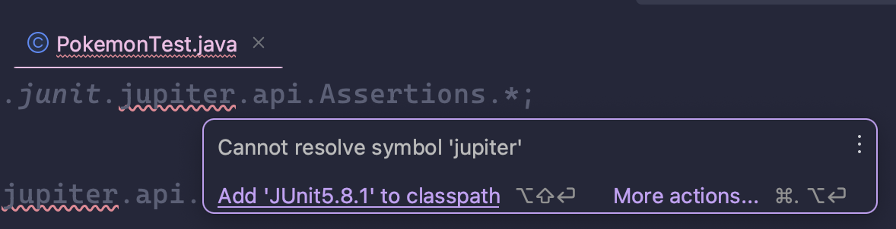
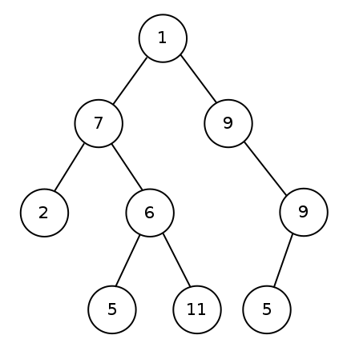

# Exercise 11.1 - 🔄 Binary Tree Recursion

## 🎯 Objectives

- **Implement** various functions recursively in Java.

## 🔨 Setup

1. Clone the repo (or download the zip) for this exercise, which you can find [here](https://github.com/JAC-CS-Programming-4-W23/E11.1-Binary-Tree-Recursion).
2. Start IntelliJ, go to `File -> Open...`, and select the cloned/downloaded folder.
3. If at the top it says "Project JDK is not defined", click "Setup JDK" on the top right, and select the JDK version you have installed on your machine.

   

4. To get the unit tests to work, open `BinaryTreeTest.java` and add JUnit to the classpath:

   

   - Just click "OK" on the resulting dialogue window and all the test-related red squigglies should disappear.

## 🔍 Context

In computer science, a binary tree is a tree data structure in which each node has at most two children, which are referred to as the left child and the right child. [^1]

Trees lend themselves very well to recursive functions since trees are simply composed of smaller subtrees! In this exercise, you'll be implementing 3 recursive functions on a binary tree class.

## 🚦 Let's Go

1. `int size(Node<T> root)`
   - The size of a tree is equal to the number of its nodes.
   - Base case: When there are no further nodes to travel down.
   - Strategy: The size of a tree is equal to the size of its left subtree plus its right sub tree plus itself.

   

2. `int leafCount(Node<T> root)`
   - The leaves of a tree are nodes with no children.
   - Base case: When there are no further nodes to travel down.
   - Strategy: The number of leaves of a tree is equal to the number of leaves contained in its left subtree plus the number of leaves in its right subtree.

3. `int height(Node<T> root)`

   

   - Base case: When there are no further nodes to travel down.
   - Strategy: The height of a tree is the greater of the height of its left subtree or right subtree plus itself.

   

## 🔬 Observations

- Trees are great and all, but can you think of any practical applications of trees?

---

 [^2]

[^1]: https://en.wikipedia.org/wiki/Recursion_%28computer_science%29
[^2]: https://xkcd.com/835/
